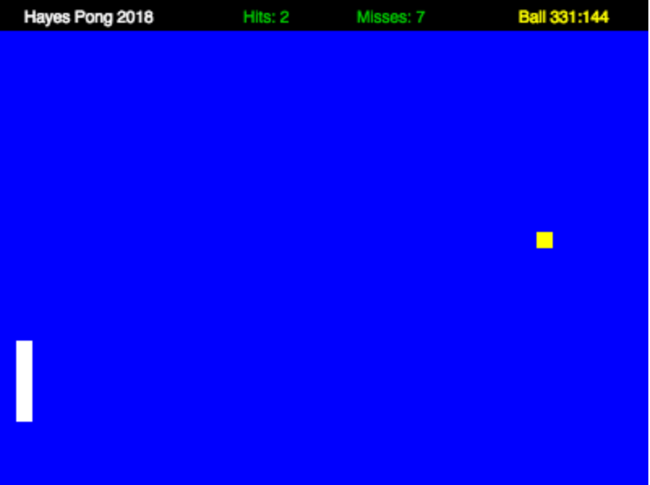

# hayesgopong
Classic pong game written in golang compile to javavscript for viewing in a browser.





Demo

http://hayespong.s3-website-us-east-1.amazonaws.com/

# Compiling

Install gopherjs and the supporting libraries.
Build and Serve

```console
$ go get github.com/gopherjs/gopherjs
$ go get github.com/gen2brain/beeep
$ go get github.com/gopherjs/gopherwasm/js
$ gopherjs build github.com/KeithHayes23/hayesgopong
$ gopherjs serve github.com/KeithHayes23/hayesgopong

Point your browser to localhost:8080
